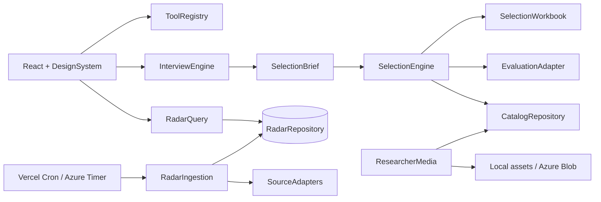

# Arquitetura v2 — Plataforma de Inteligência de Stakeholders SENAI-SP (histórico)

> Referência histórica. Para execução, usar `docs/PLANO-PRODUTO-LUNA-v3.md`. A decisão vigente remove todas as fotos, avatares, iniciais e placeholders de pesquisadores; qualquer onda de imagens abaixo está cancelada.

## 1. Objetivo desta versão

Evoluir o MVP atual para uma ferramenta visualmente mais madura e operacionalmente confiável, com quatro capacidades igualmente visíveis:

1. selecionar stakeholders por uma entrevista adaptativa e uma avaliação multidimensional profunda;
2. consultar o catálogo de pesquisadores, escolas e organizações;
3. acompanhar novidades de EPT/VET por um Radar abastecido automaticamente;
4. gerar prompts padronizados para pesquisas externas.

Esta arquitetura preserva três decisões anteriores: o ranking usa somente stakeholders cadastrados, as respostas da seleção não são persistidas e toda recomendação mantém rastreabilidade estruturada.

## 2. Diagnóstico do código atual

- A Home prioriza a seleção com um hero e CTA principal; as demais ferramentas aparecem como secundárias.
- O tema MUI possui essencialmente azul e vermelho e aplica o mesmo hover a todos os cards.
- Os 100 pesquisadores apontam para `ui-avatars`. Existem 9 imagens reais em `public/fotos`, mas o JSON não as referencia.
- A entrevista possui oito perguntas fixas, quase todas em texto livre.
- O fallback local usa sobreposição lexical, valores padrão amplos e corta a shortlist rigidamente em cinco.
- A avaliação por IA recebe todo o catálogo em uma única chamada e retorna apenas seis notas agregadas.
- O exportador oferece XLSX, PDF, DOCX e PPTX; três formatos não geram valor suficiente e aumentam dependências e bundle.
- O Radar consulta OpenAlex/Crossref durante a requisição do usuário, não persiste itens e usa seeds como fallback. Governo e organismos internacionais ainda não têm ingestão real.

## 3. Decisões arquiteturais

### 3.1 Manter o stack principal

Manter React 19, Vite, React Router e MUI 7. Não migrar agora para Next.js, TypeScript ou outro kit visual. A mudança deve aprofundar módulos existentes, não iniciar uma reescrita ampla.

### 3.2 Criar módulos profundos em seams estáveis

Cada módulo abaixo expõe uma interface pequena e concentra sua complexidade internamente:

- `DesignSystem`: tokens, tema e padrões visuais reutilizáveis.
- `InterviewEngine`: conduz a entrevista adaptativa e produz um briefing estruturado.
- `SelectionEngine`: filtra, avalia, diversifica e explica o ranking.
- `SelectionWorkbook`: gera a única exportação oficial, em XLSX.
- `ResearcherMedia`: resolve, valida, otimiza e registra imagens.
- `RadarIngestion`: coleta, normaliza, deduplica, classifica e publica novidades.
- `RadarQuery`: consulta itens já processados, sem buscar sites externos durante a navegação.
- `ToolRegistry`: única fonte de verdade para Home, navegação e metadados das ferramentas.

### 3.3 Adapters substituíveis apenas onde há variação real

- IA: `OpenRouterEvaluationAdapter`, `AzureEvaluationAdapter` e fake de testes.
- Catálogo: `JsonCatalogAdapter` agora; repositório corporativo depois.
- Radar: adapters OpenAlex, Crossref, RSS/Atom e HTML institucional.
- Persistência do Radar: Postgres compatível no MVP; Azure Database for PostgreSQL no handoff.
- Imagens: arquivos locais no MVP; Azure Blob Storage no handoff.
- Agendamento: Vercel Cron no MVP; Azure Functions Timer Trigger no handoff.

## 4. Visão geral



## 5. Design system e UX

### 5.1 Tokens

Substituir cores soltas por tokens semânticos:

- marca: azul SENAI e vermelho institucional;
- seleção: violeta/índigo;
- catálogo: azul/cobalto;
- Radar: teal/ciano;
- gerador de prompt: âmbar/laranja;
- estados: verde, amarelo, vermelho e cinzas neutros;
- superfícies: `canvas`, `surface`, `surfaceRaised`, `surfaceTinted` e `borderSubtle`;
- raios: 12, 16 e 24 px;
- sombras: níveis 0 a 3;
- motion: 120–220 ms, respeitando `prefers-reduced-motion`.

Habilitar CSS theme variables do MUI para reduzir cores hardcoded e facilitar futuro tema corporativo. O modo escuro é opcional e não bloqueia esta versão.

### 5.2 Primitivos visuais

Criar em `src/design-system/`:

- `AppShell`: header compacto, navegação responsiva e área de conteúdo consistente;
- `PageHeader`: título, descrição, ações e cor temática da ferramenta;
- `ToolCard`: card interativo com ilustração/ícone, resumo e status;
- `SectionCard`: superfície sem hover quando não é clicável;
- `FilterBar`: busca e filtros responsivos;
- `ProfileAvatar`: imagem, skeleton, fallback e origem acessível;
- `MetricChip`, `SourceBadge`, `ConfidenceBadge` e `EmptyState`;
- `InterviewQuestion`: renderiza os tipos de pergunta sem duplicar layout.

Cards estáticos não devem se mover no hover. Cor deve indicar função e hierarquia, não decoração aleatória.

### 5.3 Imagens na UX

- Usar retratos reais nos cards e resultados de pesquisadores.
- Usar ilustrações locais leves ou padrões abstratos nas quatro ferramentas da Home.
- Não usar imagens ornamentais em cada card do Radar; quando a fonte fornecer thumbnail utilizável, exibi-la com lazy loading e fallback.
- Não depender de hotlink. Armazenar os ativos aprovados no projeto ou storage configurado.

### 5.4 Acessibilidade

- Contraste WCAG 2.2 AA.
- Navegação completa por teclado.
- Foco visível, labels reais e estados de loading/erro.
- Tabelas e gráficos com alternativa textual.
- Imagens com `alt` informativo; imagens decorativas com `alt=""`.

## 6. Home equilibrada

Remover o hero que prioriza a seleção. A Home passa a ter:

1. cabeçalho neutro: “Central de Inteligência em EPT e Parcerias”;
2. grid de quatro `ToolCard` com o mesmo peso visual:
   - Seleção de stakeholders;
   - Catálogo;
   - Radar EPT/VET;
   - Gerador de prompt;
3. indicadores discretos: total de perfis, última atualização do Radar e quantidade de fontes monitoradas;
4. bloco final “Como usar” em três passos, sem CTA dominante.

O catálogo aparece como uma ferramenta única na Home e abre uma página com três categorias. Pesquisadores, escolas e organizações continuam acessíveis diretamente pela navegação.

`ToolRegistry` deve conter título, descrição, rota, ícone, cor e disponibilidade. Home e AppShell leem o mesmo registro.

## 7. Entrevista adaptativa

### 7.1 Interface externa

```js
InterviewEngine.start({ category, objective }) -> InterviewState
InterviewEngine.answer(state, answer) -> InterviewState
InterviewEngine.revise(state, questionId, answer) -> InterviewState
InterviewEngine.finalize(state) -> SelectionBrief
```

O React conhece somente `InterviewState`: pergunta atual, progresso, respostas, validação e possibilidade de revisão.

### 7.2 Estrutura de uma pergunta

```js
{
  id,
  stage,
  dimensions,
  categories,
  objectives,
  kind,
  prompt,
  helper,
  example,
  options,
  allowUnknown,
  required,
  showWhen,
  normalization
}
```

Tipos: escolha única, múltipla escolha, escala, prioridade ordenável, escolha forçada entre trade-offs, texto curto e texto detalhado.

### 7.3 Estágios

1. intenção e situação concreta;
2. resultado esperado e indicadores de sucesso;
3. aderência temática e contribuição à indústria paulista;
4. público, profundidade técnica e formato de participação;
5. credibilidade e tipo de evidência desejada;
6. capacidade de colaboração e relacionamento esperado;
7. viabilidade: prazo, idioma, localização, orçamento e modalidade;
8. riscos, conflitos, restrições e critérios eliminatórios;
9. diversidade e trade-offs da shortlist;
10. revisão final das respostas e incertezas.

A entrevista deve ter normalmente 14–18 perguntas. Respostas “não sei ainda” geram perguntas de descoberta simples; respostas completas pulam ramificações redundantes. Nenhum fluxo ultrapassa 20 perguntas.

### 7.4 Briefing estruturado

`SelectionBrief` não é um bloco de texto. Deve conter:

```js
{
  category,
  objective,
  context,
  desiredOutcomes,
  audience,
  themes,
  contributionTypes,
  evidencePreferences,
  collaborationModel,
  feasibility,
  hardConstraints,
  riskRules,
  diversityPreferences,
  dimensionWeights,
  uncertainties,
  answers
}
```

Pesos são derivados das respostas dentro de faixas controladas; o usuário leigo não edita percentuais diretamente.

## 8. Avaliação multidimensional e shortlist diversa

### 8.1 Subcritérios obrigatórios

Cada uma das seis dimensões permanece visível, mas passa a ser composta:

- impacto: contribuição ao resultado, escala, profundidade e transferibilidade;
- alinhamento estratégico: tema contextual, EPT, indústria paulista e baseline SENAI-SP;
- credibilidade: qualidade/recência das evidências, trajetória, reconhecimento e consistência;
- colaboração: histórico de parceria, co-criação, comunicação e adequação ao formato;
- viabilidade: idioma, geografia, prazo, acesso, modalidade e restrições informadas;
- risco controlado: conflito de interesse, risco reputacional, incerteza de dados e dependências.

Há subcritérios próprios por categoria e objetivo. Exemplo: palestrante pesquisador considera comunicação e casos aplicados; escola para benchmarking considera governança e transferibilidade; organização parceira considera mandato, recursos e capacidade de execução.

### 8.2 Pipeline

1. aplicar critérios eliminatórios;
2. extrair features estruturadas do catálogo com proveniência;
3. pré-classificar todo o catálogo deterministicamente;
4. selecionar 20–30 candidatos para avaliação profunda;
5. avaliar em lotes pequenos pelo adapter de IA, com schema estruturado;
6. recalcular notas e pesos deterministicamente;
7. aplicar diversidade e cobertura;
8. montar 5–10 resultados com explicações e lacunas.

A IA nunca define sozinha a nota final. Ela produz subnotas, evidências, hipóteses e lacunas; o `SelectionEngine` aplica a fórmula.

### 8.3 Diversidade

Após o fit, aplicar reranking por similaridade entre candidatos:

```text
nota de seleção = fit multidimensional
                  - penalidade de similaridade com já selecionados
                  + bônus de cobertura das preferências
```

Similaridade considera instituição, país/região, especialidade, tipo de contribuição, abordagem e perfil de colaboração. A regra não deve forçar diversidade que contradiga critérios eliminatórios.

### 8.4 Quantidade

- mínimo: 5 candidatos elegíveis;
- máximo: 10;
- padrão adaptativo: incluir candidatos dentro de uma janela de qualidade do último recomendado, limitado a 10;
- se houver menos de cinco com alta aderência, completar até cinco com uma faixa “exploratória”, destacando lacunas;
- candidatos com risco grave confirmado ou critério eliminatório nunca são reintroduzidos apenas para atingir cinco;
- se sobrarem menos de cinco elegíveis, solicitar revisão de uma restrição e explicar a impossibilidade.

### 8.5 Rastreabilidade

Para cada subcritério, registrar:

- nota;
- peso;
- evidência/campo de origem;
- regra aplicada;
- confiança;
- lacuna;
- penalidades e bônus de diversidade.

Não registrar raciocínio interno do modelo. Expor somente justificativas estruturadas e auditáveis.

## 9. Planilha rica como única exportação

Remover PDF, Word e PowerPoint da interface e, depois de validar a planilha, remover `jspdf`, `jspdf-autotable`, `docx` e `pptxgenjs` das dependências.

O módulo `SelectionWorkbook.export(result, metadata)` gera:

1. `Leia-me`: finalidade, data, aviso de uso e legenda;
2. `Contexto`: briefing estruturado e incertezas;
3. `Shortlist`: ranking, faixas, totais, recomendação e hyperlinks;
4. `Comparação detalhada`: seis dimensões e todos os subcritérios;
5. `Evidências`: uma linha por evidência com URL, campo, data e confiança;
6. `Riscos e lacunas`: riscos, restrições e informações ausentes;
7. `Respostas`: perguntas e respostas revisadas;
8. `Metodologia`: pesos, fórmula, versões, provider/modelo e regras de diversidade;
9. `Catálogo considerado`: candidatos avaliados, eliminados e motivos.

Requisitos de qualidade:

- tabelas formatadas, filtros, painéis congelados e larguras adequadas;
- cores condicionais para notas, riscos e confiança;
- hyperlinks clicáveis;
- células com wrap e cabeçalho repetido;
- mesma informação exibida no site e exportada;
- nenhum segredo ou resposta fora da sessão além do arquivo baixado pelo usuário.

## 10. Imagens dos pesquisadores

### 10.1 Situação e meta

O catálogo tem 100 pesquisadores e 100 placeholders. Há 9 fotos locais ainda não vinculadas. Meta: 100% dos pesquisadores com foto real e origem registrada antes de considerar a etapa concluída.

### 10.2 Modelo

Adicionar ao perfil:

```js
image: {
  path,
  sourceUrl,
  sourceType,
  license,
  attribution,
  retrievedAt,
  status,
  confidence,
  reviewedAt
}
```

`status`: `approved`, `needs-review`, `missing` ou `blocked`.

### 10.3 Pipeline

1. conectar as 9 fotos já existentes aos perfis corretos;
2. gerar manifesto dos 91 pesquisadores restantes;
3. buscar por prioridade: página institucional, página pessoal acadêmica, Wikimedia/Commons, perfil público acadêmico e rede social pública;
4. baixar o arquivo, sem hotlink;
5. validar formato, dimensões, checksum e correspondência nominal/contextual;
6. converter para WebP quadrado de 320 e 640 px, preservando original quando permitido;
7. registrar origem/licença e enviar casos ambíguos para revisão;
8. atualizar o catálogo somente após aprovação.

Não usar reconhecimento facial para identificar pessoas. Correspondência deve usar nome, instituição, página de origem e revisão visual. Imagem com licença desconhecida pode ser usada no MVP restrito somente com `sourceUrl` e status explícito, permanecendo na fila de substituição.

### 10.4 Seam de armazenamento

```js
ImageStore.put({ key, bytes, contentType }) -> { url, checksum }
ImageStore.get(key)
```

Adapters: `LocalImageStore` agora e `AzureBlobImageStore` depois.

## 11. Radar completo

### 11.1 Princípio

A página nunca consulta fontes externas diretamente. Ela lê itens processados do `RadarRepository`. A coleta ocorre em background.

### 11.2 Persistência

Tabelas mínimas:

- `radar_sources`: fonte, seção, adapter, URL, frequência, allowlist, status e último sucesso;
- `radar_items`: item normalizado, título original, resumo em português, URL, publicação, temas, geografia, relevância, status e hash;
- `radar_item_sources`: proveniência e payload original mínimo;
- `radar_sync_runs`: início, fim, quantidade, erros e cursor;
- `researcher_identities`: pesquisador, OpenAlex ID, ORCID, confiança e revisão;
- `researcher_publications`: ligação entre pesquisador cadastrado e item acadêmico.

### 11.3 Adapters

- `OpenAlexAuthorAdapter`: identifica autores por OpenAlex ID/ORCID e busca obras por autor e data;
- `CrossrefEnrichmentAdapter`: confirma DOI e enriquece metadados;
- `FeedAdapter`: RSS/Atom de fontes oficiais;
- `InstitutionalHtmlAdapter`: listas e páginas oficiais sem feed, configuradas por seletores e regras de domínio;
- fake em memória para testes.

OpenAlex genérico deixa de ser o mecanismo principal. O fluxo acadêmico começa pela resolução de identidade dos 100 pesquisadores. Correspondências ambíguas ficam em quarentena e não publicam itens automaticamente.

### 11.4 Pipeline de ingestão

```text
buscar -> normalizar -> validar domínio -> deduplicar -> classificar relevância
       -> relacionar pesquisador -> resumir/traduzir -> publicar ou quarentena
```

Chaves de deduplicação: DOI, ID OpenAlex, URL canônica e hash de título+fonte+data.

Classificação exige relação substantiva com EPT/VET, competências, aprendizagem profissional ou desenvolvimento da indústria. Itens tangenciais são descartados. Resumo em português preserva título original, idioma e link.

### 11.5 Agendamento e confiabilidade

- Vercel Cron dispara endpoints protegidos por `CRON_SECRET` no MVP.
- Dividir execuções por grupos de fontes e checkpoint para evitar timeout.
- Pesquisa acadêmica: diária.
- Governo federal e São Paulo: a cada 6 horas.
- Organismos internacionais: a cada 12 horas.
- Retry com backoff, limite por domínio e User-Agent identificável.
- Painel admin mostra última sincronização, falhas, itens em quarentena e fontes desatualizadas.
- Na Azure, trocar somente o scheduler por Azure Functions Timer Trigger; `RadarIngestion` permanece igual.

### 11.6 Interface de leitura

```js
RadarQuery.search({ section, text, period, topics, contentType, source, geography, sort, page })
  -> { items, facets, pagination, freshness }
```

O front recebe facets calculadas pelo backend, paginação e status de atualização. O modo demonstração e os seeds saem da UI.

## 12. Estrutura de arquivos alvo

```text
src/
  app/
    ToolRegistry.js
    AppShell.jsx
  design-system/
    theme.js
    tokens.js
    primitives/
  features/
    selection/
      interview/
      results/
      domain/
      export/
    catalog/
    radar/
    prompt-generator/
server/
  modules/
    selection/
      SelectionEngine.js
      adapters/
    radar/
      RadarIngestion.js
      RadarQuery.js
      adapters/
      repository/
    media/
      ResearcherMedia.js
      stores/
  lib/
api/
  selection/
  radar/
  jobs/
scripts/
  researcher-images/
db/
  migrations/
```

A migração é incremental. Não mover arquivos sem entregar comportamento na mesma mudança.

## 13. Ordem de execução para o Luna

### Onda 0 — contratos e proteção contra regressão

- atualizar PRD e testes de aceite;
- introduzir `ToolRegistry`, schemas de `SelectionBrief`, `SelectionResult` e `RadarItem`;
- criar testes de contrato antes de alterar telas;
- manter os dois arquivos não rastreados atuais fora dos commits.

### Onda 1 — design system e Home

- criar tokens, primitivos e AppShell;
- refazer Home com quatro ferramentas equivalentes;
- aplicar cores temáticas por ferramenta;
- validar responsividade, teclado, contraste e loading states.

### Onda 2 — entrevista, avaliação e shortlist

- implementar `InterviewEngine` adaptativo;
- implementar subcritérios e `SelectionBrief`;
- refatorar avaliação em prefilter, lotes, recomposição e diversidade;
- alterar limite para 5–10;
- aprofundar tela de resultados e rastreabilidade;
- criar testes com contextos contrastantes que produzam rankings diferentes.

### Onda 3 — planilha única

- redesenhar workbook com nove abas;
- remover os três botões e builders sem valor;
- validar abertura, hyperlinks, filtros e consistência;
- remover dependências apenas depois do teste de exportação passar.

### Onda 4 — imagens

- vincular as 9 imagens existentes;
- implementar manifesto, validação e processamento;
- preencher os 91 restantes em lotes revisáveis;
- só remover `ui-avatars` quando a cobertura real atingir 100%.

### Onda 5 — Radar persistente

- adicionar banco e migrações;
- implementar repositório, source registry e adapters;
- resolver identidades dos pesquisadores;
- implementar ingestão, classificação, quarentena e cron;
- trocar a página para `RadarQuery` e remover seeds/modo demonstração.

### Onda 6 — hardening e handoff Azure

- testes de carga, limites de custo e observabilidade;
- documentação das variáveis e rotação das chaves pessoais;
- adapters Azure para IA, storage, banco, scheduler e autenticação;
- checklist de handoff sem segredos pessoais.

## 14. Critérios de aceite v2

### UX

- Home dá o mesmo peso às quatro ferramentas.
- Design tokens substituem cores repetidas em páginas e cards.
- Fluxos principais funcionam em desktop e celular e atendem contraste AA.

### Imagens

- 100/100 pesquisadores possuem imagem real aprovada.
- Nenhum perfil usa `ui-avatars`.
- Toda foto tem origem e status registráveis.

### Seleção

- Entrevista normalmente contém 14–18 perguntas e ramifica por categoria, objetivo e respostas.
- Contextos deliberadamente diferentes produzem briefings, pesos e rankings materialmente diferentes.
- Shortlist contém 5–10 candidatos elegíveis.
- A diversidade altera a ordem somente com regra e penalidade visíveis.
- Toda subnota possui evidência, lacuna ou indicação explícita de ausência.

### Exportação

- A interface oferece somente XLSX.
- A planilha possui as nove abas e abre sem reparo no Excel.
- Site e planilha apresentam as mesmas notas, pesos, evidências e lacunas.

### Radar

- Nenhum item exibido depende de seed de demonstração.
- Pesquisas são ligadas a pesquisadores cadastrados por identificador revisado.
- Fontes governamentais e internacionais são coletadas automaticamente.
- Itens têm URL original, data, fonte, relevância e proveniência.
- Falha de fonte aparece no painel admin sem derrubar a leitura do Radar.

## 15. Variáveis novas previstas

```text
DATABASE_URL
CRON_SECRET
RADAR_SYNC_ENABLED
RADAR_SUMMARY_PROVIDER
OPENALEX_API_KEY
OPENALEX_MAILTO
ASSET_STORAGE_DRIVER
AZURE_STORAGE_CONNECTION_STRING
AZURE_STORAGE_CONTAINER
```

Nenhuma variável sensível usa prefixo `VITE_`. OpenRouter e credenciais atuais permanecem no servidor e devem ser removidos/revogados no handoff corporativo.

## 16. Riscos que devem ser tratados durante a execução

- Scrapers HTML quebram quando o site muda: manter health check, fixture de teste e quarentena.
- Identidades acadêmicas homônimas podem gerar publicação errada: exigir IDs e revisão para baixa confiança.
- Avaliação de muitos candidatos aumenta custo e latência: prefilter determinístico, lotes pequenos e cache de features.
- Fotos públicas podem ter licença incerta: manter origem, status e fila de substituição.
- Diversidade artificial pode reduzir fit: limitar penalidade e exibir seu efeito.
- Banco externo do MVP cria dependência temporária: usar SQL e repository seam compatível com Azure PostgreSQL.
